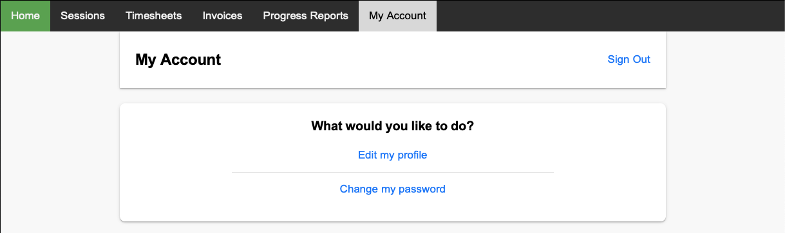
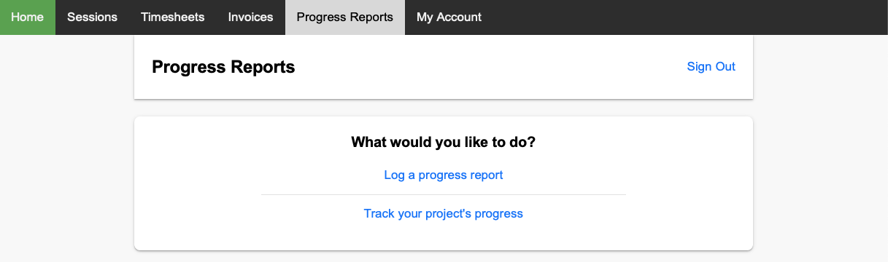
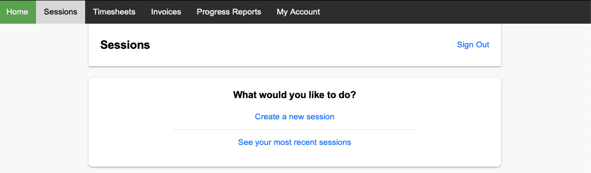

# Atlas

A comprehensive project management web application developed using the Django framework, incorporating Python, JavaScript, and Django REST Framework. It encompasses several modules and functionalities related to user management, invoicing, progress reporting, session tracking, and timesheet management.

The core functionalities in the webproject are as follows:

| Core Functionalities |                                                                      Description                                                                       |
|----------------------|:------------------------------------------------------------------------------------------------------------------------------------------------------:|
| User Management      |                            Provides a set of features related to user registration, authentication, and profile management.                            |
| Invoices             |                          Users can generate invoices for their services or products and keep track of them within the system.                          |
| Progress Reports     |   Helps users track and communicate the status of their projects effectively; allows users to create, edit, and view progress reports for projects.    |
| Session Tracking     | Provides users to effectively monitor and manage their work sessions, providing them with accurate records of their working time for various purposes. |
| Timesheet Management |                                         Designed to facilitate the tracking and analysis of recorded sessions.                                         |

### User Management:

The User Management component of the project is responsible for handling various user-related functionalities, including registration, authentication, and profile management. It is implemented using the `accounts` core app, which leverages Django's built-in authentication system.

1. User Registration:
   * The User Management feature allows new users to register for an account within the application.
   During the registration process, users typically provide information such as their desired username, email address, and password.
   The system validates the user's input, ensuring that the username and email address are unique and that the password meets any specified criteria (e.g., minimum length, complexity requirements).
   If the provided information passes validation, a new user account is created and stored in the database, associating it with the provided username and email address.

2. Authentication:
   * Once registered, users can log in to the application using their credentials.
   The authentication process verifies the user's identity by checking the provided username/email and password against the stored account information.
   If the provided credentials match an existing user account, the system grants access to the user by creating a session or issuing an authentication token.
   This session or token is used to maintain the user's authenticated state during their interaction with the application.
   Subsequent requests from the user include this session/token to authenticate their identity and authorize their actions.

3. Profile Management:
   * After logging in, users have the ability to manage their profile within the application.
   Profile management includes updating and modifying user information such as their name, contact details, or any other relevant personal details.
   The system provides forms or interfaces where users can make changes to their profile information.
   Once the user submits the updated information, the system validates and saves the changes, ensuring the data is consistent and adheres to any defined constraints.
   The updated user profile information is then stored in the database, reflecting the modifications made by the user.

### Invoices:

The Invoices app streamlines the process of creating and managing invoices within the webproject. It offers flexibility in capturing task details, calculates the total amount based on the hourly rate, and provides a centralized location for organizing and accessing invoice records. By automating certain aspects of the invoicing process, the app simplifies and enhances the overall invoice management experience for users.

1. Creation and Management of Invoices:
   * Users can create new invoices directly within the application. They have the ability to specify various details for each invoice, 
   including tasks, descriptions, and total hours worked. Users can input task-specific information and provide descriptions to add context to each invoice.

2. Hourly Rate Calculation:
   * The system automatically calculates the total amount for each invoice based on the selected hourly rate. When creating an invoice, users can choose an hourly rate that is applicable to the tasks performed. The system then multiplies the total hours worked by the hourly rate to determine the total amount for the invoice.

3. Flexibility and Customization:

   * The Invoice app offers flexibility and customization options to cater to different invoice requirements. Users can input task-specific information, allowing them to break down the work performed into granular details. Additionally, users can add descriptions to provide additional information or specify any relevant notes for each invoice.

5. Management and Organization:
   * Invoices created within the app are stored and managed, providing users with a centralized location to track and access their invoicing history. This enables users to easily retrieve and review previously created invoices.

6. Seamless Integration:
   * The Invoice app seamlessly integrates with other modules or features of your project. For example, it can be linked to sessions or progress reports, allowing users to associate invoices with specific work sessions or project milestones.

### Progress Reports:

The Progress Reports feature empowers users to effectively track and communicate the progress of their projects. By breaking down the progress reports into specific sections, users can provide detailed updates on completed work, project timelines, planned work, and project issues. 

1. Creation and Editing of Progress Reports:
   * Users can create new progress reports within the application, documenting the progress of their projects. The reports are divided into different sections, allowing users to provide updates on various aspects of the project's development. These sections typically include completed work, project timelines, planned work, and project issues.
2. Completed Work Section:
   * Within the progress reports, users can detail the work that has been completed. This section provides an opportunity to highlight accomplished tasks, milestones, or goals achieved during the project timeline. Users can update the status, provide descriptions, or add relevant information regarding the completed work.
3. Project Timelines Section:
   * The progress reports include a section dedicated to project timelines. Here, users can outline the planned timeline for the project and track the progress made against those timelines. This section allows users to update the status of different project phases, provide estimated completion dates, or indicate any deviations from the original timeline.
4. Planned Work Section: 
   * Users can document the planned work or tasks that are yet to be completed in the project. This section provides a clear overview of the upcoming tasks, allowing users to monitor the project's progress and prioritize work accordingly. Users can update the status, add descriptions, or include any specific details related to the planned work.
5. Project Issues Section:
   * The progress reports facilitate the identification and management of project issues. Users can report any challenges, roadblocks, or issues encountered during the project's execution. This section allows users to update the status, provide descriptions, and potentially propose solutions or mitigation strategies for the identified issues.
6. Comprehensive Project Overview:
   * By updating the status and details of each section within the progress reports, users can provide a comprehensive overview of the project's progress. The reports serve as a valuable tool for tracking and communicating the project's development, ensuring stakeholders are well-informed about the project's status.

### Session Tracking:

The Session Tracking feature enables users to accurately track their work sessions, ensuring precise time measurement and efficient management of work activities. The ability to pause, continue, and end sessions offers flexibility, accommodating interruptions or breaks. The generated timesheets provide users with comprehensive records of their work sessions, facilitating productivity analysis and time management. By seamlessly integrating with other project features, the Session Tracking feature enhances overall project management capabilities.

1. Work Session Tracking: 
   * Users can effectively track their work sessions within the application. They have the ability to start, pause, 
   continue, and end sessions as needed, providing precise tracking of their work activities.
2. Pause and Continue Functionality:
   * The system allows users to pause their work sessions whenever necessary. This feature is particularly useful when 
   interruptions or breaks occur during the work process. Users can then resume the session from the exact point where they left off, ensuring accurate time tracking.
3. Timesheet Generation: 
   * Once a work session is completed, users can choose to end the session. The system records the end time of the session and calculates the total hours worked. Users can then generate timesheets that include detailed information such as start times, end times, and total hours for each session.
4. Accurate Time Tracking:
   * The Session Tracking feature ensures precise time tracking for each work session. By capturing start and end times, as well as any pauses during the session, the system accurately calculates the total hours worked. This provides users with a reliable record of their work activities.
5. Comprehensive Timesheets:
   * The generated timesheets offer a consolidated view of all recorded work sessions. Users can easily review and analyze their session data, including start times, end times, and total hours worked. Timesheets serve as a valuable resource for monitoring productivity and managing time effectively.
6. Integration with Other Features: 
   * The Session Tracking feature seamlessly integrates with other modules or functionalities of your project. For example, it can be associated with invoices, progress reports, or timesheet management, allowing users to link work sessions to specific tasks or project milestones.

### Timesheet Management

The Timesheet Management feature empowers users to effectively manage and analyze their recorded work sessions. Through timesheets, users can access detailed information about their sessions, filter the data based on specific criteria, and gain insights into their productivity. By centralizing the record keeping and integrating with other project features, the Timesheet Management feature enhances overall project management capabilities and facilitates productivity tracking and analysis.

1. Timesheet Viewing and Analysis:
   * The project includes functionalities that enable users to view and analyze their recorded work sessions through timesheets. Timesheets serve as a consolidated view of the recorded sessions, providing users with a comprehensive overview of their work activities.
2. Session Filtering: 
   * Users have the ability to filter their recorded sessions based on specific criteria such as day, week, or month. This filtering capability allows users to focus on a specific time period and retrieve relevant session data for analysis or review.
3. Detailed Session Information:
   * Timesheets display detailed information for each recorded session, including start times, end times, and total hours worked. This level of detail provides users with precise insights into their work activities and enables them to track their productivity accurately.
4. Productivity Analysis: 
   * By reviewing the data within the timesheets, users can analyze their work patterns, identify peak productivity periods, and assess their overall productivity levels. Timesheets serve as a valuable tool for self-reflection, goal setting, and productivity improvement.
5. Centralized Record Keeping: 
   * The Timesheet Management feature centralizes the storage and management of recorded work sessions. Users can conveniently access and retrieve their timesheets whenever needed, ensuring easy record keeping and reference.
6. Integration with Other Features: 
   * The Timesheet Management feature seamlessly integrates with other modules or functionalities within your project. For example, timesheets can be linked to invoicing, progress reporting, or session tracking, providing a comprehensive overview of project-related activities.

